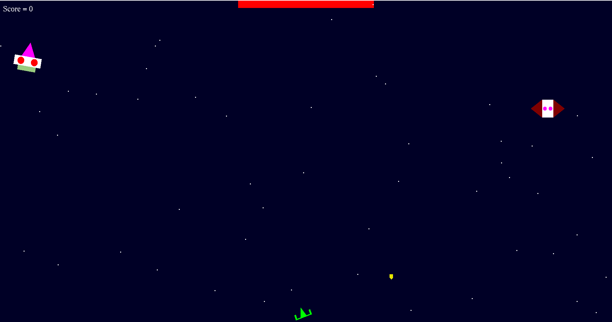

# Space Shooter

## Description
Space Shooter is a 2d game developed using C++ and OpenGL framework. The player takes control of a spaceship and the goal is to defeat the enemy boss while avoiding the bullets fired by the him and his minions. The boss has a health bar and each time the player hits him with a bullet, the boss's health decreases by one point and the player's score increases by one point. When the boss is finally defeated, another one respawns with a lot more hitpoints. 
The player can collect two different types of collectibles, one for increasing his firerate, and the other reduces the boss's health by half.
## Controls
<ul>
<li> Use the mouse to move the player horizontally</li>
<li> Press space to fire bullets</li>
</ul>
